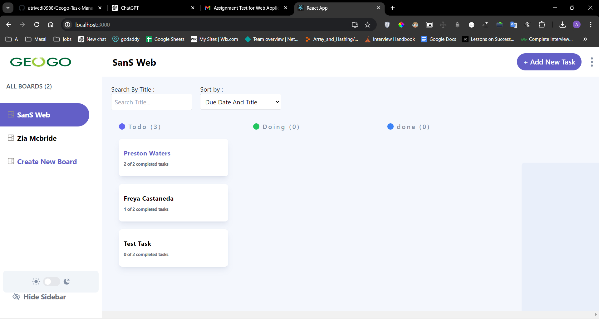
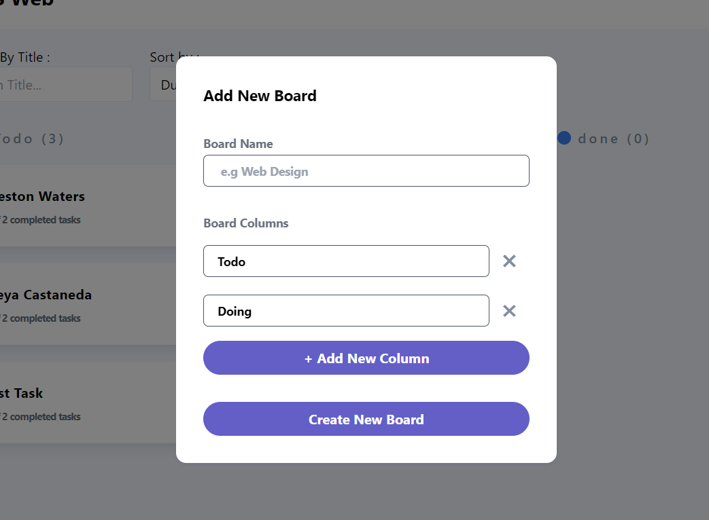
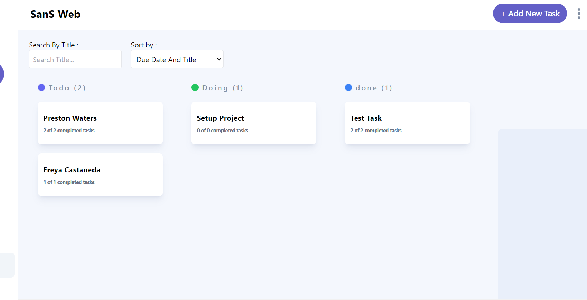
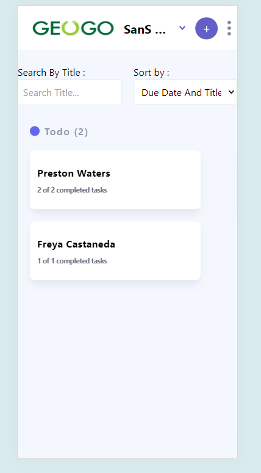

# Geogo Task Management

## Overview

Geogo Task Management is a task management application built using React, Redux, and Tailwind CSS. It is a fully responsive web application that allows users to create boards, manage tasks, and perform CRUD operations. The application also supports sorting, filtering, and searching tasks.

## Features

- Create, read, update, and delete tasks
- Create and manage boards
- Sort, filter, and search tasks
- Fully responsive design

## Tech Stack

- **React**: JavaScript library for building user interfaces
- **Redux**: State management tool for JavaScript apps
- **Tailwind CSS**: Utility-first CSS framework

## Installation

### Prerequisites

- Node.js (v12 or higher)
- npm (v6 or higher)

### Steps

1. Clone the repository

   ```sh
   git clone https://github.com/atrivedi8988/Geogo-Task-Management.git
   cd Geogo-Task-Management
   ```

2. Install dependencies

   ```sh
   npm install --force
   ```

3. Start the frontend server

   ```sh
   npm run start
   ```

   This will start the frontend server on port 3000.

4. Start the backend server
   Open a new terminal and run:

   ```sh
   cd Geogo-Task-Management
   npm run serve
   ```

   This will start the backend JSON server on port 8000.

5. Open your browser and go to `http://localhost:3000` to explore the website.

## Usage

- To create a new board, click on the "Create Board" button and fill out the form.
- To create a task, select a board and click on the "Create Task" button.
- Use the search bar to find tasks by name.
- Use the sort and filter options to organize tasks.

## Screenshots

You can view screenshots of the application at various stages here:

1. **Home Page**
   

2. **Create Board**
   

3. **Task Management**
   

4. **Responsive Design**
   
